<div align="center">

# 👋 Welcome to My Cyber Domain

### Cybersecurity Professional | Penetration Tester | Python Developer

[](https://twitter.com/AsroyxCySec)
[](https://github.com/asroyxCySec)
[](https://github.com/asroyxCySec)

</div>

---

## 🛡️ About Me

```python
class CyberSecuritySpecialist:
    def __init__(self):
        self.name = "Asroy Cristian Sitorus"
        self.role = "Cybersecurity Professional"
        self.location = "Indonesia 🇮🇩"
        self.passion = "Protecting data and systems from cyber threats"
        
    def get_skills(self):
        return {
            "security": ["Penetration Testing", "Vulnerability Assessment", "Security Auditing"],
            "languages": ["Python", "Bash", "JavaScript", "SQL"],
            "tools": ["Metasploit", "Burp Suite", "Nmap", "Wireshark", "SQLMap"],
            "specialization": ["Web Application Security", "Network Security", "OSINT"]
        }
    
    def current_focus(self):
        return [
            "Building advanced security tools with AI",
            "Researching zero-day vulnerabilities",
            "Contributing to cybersecurity community"
        ]

me = CyberSecuritySpecialist()
```

---

## 🚀 Tech Stack & Tools

<div align="center">

### Languages


### Security Tools


### Platforms & Technologies


</div>

---

## 🔥 Featured Projects

<div align="center">

| Project | Description | Stars |
|---------|-------------|-------|
| 🛡️ **[CyberGuard](https://github.com/asroyxCySec/CyberGuard)** | Toolkit cybersecurity yang powerful, etis, dan legal! |  |
| 🔍 **[Pentest-Tools-AI-Include-Powerfull](https://github.com/asroyxCySec/Pentest-Tools-AI-Include-Powerfull)** | Tools Pentest Menggunakan Teknologi AI Yang Sangat Perform |  |

</div>

---

## 📊 GitHub Statistics

<div align="center">
  
  
</div>

<div align="center">
  
</div>

---

## 🎯 Current Focus

```yaml
learning:
  - "Advanced AI in Cybersecurity"
  - "Exploit Development"
  - "Cloud Security (AWS, Azure)"
  
working_on:
  - "AI-powered Penetration Testing Tools"
  - "Automated Vulnerability Scanner"
  - "Security Blog & Tutorials"
  
goals_2025:
  - "Contribute to major open-source security projects"
  - "Obtain OSCP certification"
  - "Publish security research papers"
```

---

## 🏆 Achievements & Certifications

<div align="center">

| 🎓 Certification | 📅 Year | 🏢 Issuer |
|------------------|---------|-----------|
| Certified Ethical Hacker (CEH) | 2024 | EC-Council |
| CompTIA Security+ | 2023 | CompTIA |
| Python for Cybersecurity | 2023 | Udemy |

</div>

---

## 📝 Latest Blog Posts

<!-- BLOG-POST-LIST:START -->
- 🔐 [Understanding SQL Injection: From Basics to Advanced](https://yourblog.com)
- 🛡️ [Building Your First Python Security Tool](https://yourblog.com)
- 🔍 [OSINT Techniques for Ethical Hackers](https://yourblog.com)
- ⚡ [Top 10 Security Tools Every Pentester Should Know](https://yourblog.com)
<!-- BLOG-POST-LIST:END -->

---

## 💡 Security Philosophy

<div align="center">

> *"The best security is not about building higher walls, but understanding how attackers think and staying one step ahead."*

### Core Values
🔒 **Ethics First** • 🎯 **Continuous Learning** • 🤝 **Community Driven** • 💪 **Responsible Disclosure**

</div>

---

## 🤝 Let's Connect

<div align="center">

I'm always open to discussing cybersecurity, collaborating on projects, or just having a tech chat!

[](https://twitter.com/AsroyxCySec)
[](mailto:your.email@example.com)
[](https://linkedin.com/in/yourprofile)
[](https://yourportfolio.com)

### 📊 Support My Work

If you find my projects useful, consider giving them a ⭐️!

[](https://github.com/sponsors/asroyxCySec)
[](https://buymeacoffee.com/asroyxcysec)

</div>

---

<div align="center">

### 📈 Contribution Graph


---

### 🐍 Contribution Snake


---

**⚡ "Hacking is not a crime, it's a mindset of problem solving"**


</div>

---

<div align="center">
  
### 💻 Visitor Count


**Last Updated:** November 2025

</div>
