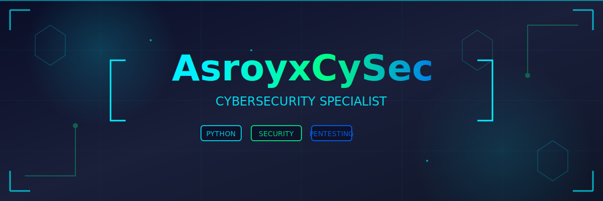

<!-- ===================== HEADER ===================== -->
<div align="center">



<a href="https://git.io/typing-svg">
  
</a>

<br/>

[](https://hackernesia.com)
[](https://twitter.com/AsroyxCySec)
[](https://github.com/asroyxCySec)
[](https://github.com/asroyxCySec)

</div>

<br/>

<!-- ===================== ABOUT ===================== -->
## `~/whoami`

```python
class CyberSecuritySpecialist:
    def __init__(self):
        self.name      = "Asroy Cristian Sitorus"
        self.alias     = "asroyxcysec"
        self.role      = "Cybersecurity Consultant @ Diskominfotik Prov. Riau (CSIRT Riau)"
        self.location  = "Pekanbaru, Riau, Indonesia 🇮🇩"
        self.focus     = "VAPT · Incident Response · Threat Intelligence · Sec Tooling"
        self.mindset   = "Understand how attackers think - stay one step ahead."

    @property
    def daily_work(self) -> list[str]:
        return [
            "Vulnerability assessment & authorized penetration testing",
            "Incident response & digital forensics",
            "Threat intelligence (MITRE ATT&CK mapping, SIEM analysis)",
            "Building production-grade security tools in Python",
            "Mentoring the next generation of defenders",
        ]

    @property
    def values(self) -> list[str]:
        return ["Ethics First", "Responsible Disclosure", "Continuous Learning"]


me = CyberSecuritySpecialist()
```

<br/>

<!-- ===================== TECH STACK ===================== -->
## `~/arsenal`

<div align="center">

**Languages**


**Offensive Security**


**Reverse Engineering & Forensics**


**Platforms & DevOps**


</div>

<br/>

<!-- ===================== PROJECTS ===================== -->
## `~/projects`

<div align="center">

| Project | Description | |
|:--------|:------------|:--|
| 🛡️ **[CyberGuard](https://github.com/asroyxCySec/CyberGuard)** | Ethical & legal cybersecurity toolkit — powerful, all-in-one. |  |
| 🤖 **[Pentest-Tools-AI](https://github.com/asroyxCySec/Pentest-Tools-AI-Include-Powerfull)** | AI-assisted penetration testing toolkit for faster recon & analysis. |  |
| 📰 **[Hackernesia](https://hackernesia.com)** | Personal cybersecurity news, research & write-ups platform. |  |

</div>

<br/>

<!-- ===================== STATS ===================== -->
## `~/stats`

<div align="center">


<br/>


<br/>


</div>

<br/>

<!-- ===================== CURRENT FOCUS ===================== -->
## `~/now`

```yaml
exploring:
  - Advanced AI applied to offensive & defensive security
  - Exploit development & zero-day research
  - Cloud security (AWS / Azure / Alibaba Cloud)

building:
  - AI-powered penetration testing & vulnerability scanners
  - Automated reporting pipelines for CSIRT engagements
  - Security write-ups & tutorials @ hackernesia.com

goals:
  - Contribute to major open-source security projects
  - Earn OSCP
  - Publish original security research
```

<br/>

<!-- ===================== CERTIFICATIONS ===================== -->
## `~/certifications`

> 45+ certifications across offensive security, GRC, cloud, and national CSIRT programs.
> Grouped below — click to expand.

<details>
<summary><b>🎯 Offensive Security & Penetration Testing</b></summary>

<br/>

| Certification | Issuer | Year |
|:--------------|:-------|:----:|
| Junior Penetration Tester | Linuxenic Corp. | 2025 |
| Web Application Pentesting | Linuxenic Corp. | 2025 |
| Hack Point Starter — Red Team Bootcamp | Hack Point | 2025 |
| Jr Penetration Tester Learning Path | TryHackMe | 2025 |
| Cyber Security 101 Learning Path | TryHackMe | 2025 |
| Lomba Hacking — HUT BSSN ke-78 | BSSN | 2024 |
| Introduction to Dark Web Operations | Security Blue Team | 2025 |
| Complete Ethical Hacking Bootcamp: Zero to Mastery | Udemy | 2022 |
| Complete Website Ethical Hacking & Pentesting | Udemy | 2022 |
| Digital Forensics Masterclass (DFMC+) | Udemy | 2023 |

</details>

<details>
<summary><b>🛡️ Governance, Risk, Audit & Compliance (GRC)</b></summary>

<br/>

| Certification | Issuer | Year |
|:--------------|:-------|:----:|
| Certified Information Systems Auditor (CISA) | Cybrary | 2023 |
| Certified Information Security Manager (CISM) | Cybrary | 2023 |
| CompTIA Security+ (SY0-601) | Cybrary | 2023 |
| ISO/IEC 27001:2022 ISMS Awareness | Mitra Berdaya Optima | 2025 |
| Introduction to Information Security | Cyber Academy | 2023 |

</details>

<details>
<summary><b>☁️ Cloud & Infrastructure</b></summary>

<br/>

| Certification | Issuer | Year |
|:--------------|:-------|:----:|
| Core Infrastructure Security Services in Azure | Microsoft | 2025 |
| ECS Fundamentals | Alibaba Cloud | 2025 |
| ApsaraDB RDS Fundamentals | Alibaba Cloud | 2025 |
| Auto Scaling Fundamentals | Alibaba Cloud | 2025 |
| OSS Fundamentals | Alibaba Cloud | 2025 |
| SLB Fundamentals | Alibaba Cloud | 2025 |

</details>

<details>
<summary><b>🤖 Microsoft Security & AI</b></summary>

<br/>

| Certification | Issuer | Year |
|:--------------|:-------|:----:|
| Basic Cybersecurity Threats, Attacks & Mitigations | Microsoft | 2025 |
| Microsoft Security Copilot | Microsoft | 2025 |
| Service Trust Portal & Privacy Capabilities | Microsoft | 2025 |
| Security & Compliance Concepts | Microsoft | 2025 |
| Effective Strategy for AI Security with NIST AI RMF | Inixindo Jogja | 2025 |

</details>

<details>
<summary><b>🌐 Network & Vendor</b></summary>

<br/>

| Certification | Issuer | Year |
|:--------------|:-------|:----:|
| Red Hat System Administration II (RH134) | Red Hat | 2022 |
| MTCNA | MikroTik | 2021 |
| Junior Network Administrator | BNSP | 2021 |
| Fortinet Certified Associate in Cybersecurity | Fortinet | 2024 |
| NSE 1 — Network Security Associate | Fortinet | 2023 |
| Mastering Linux: Complete Guide | Udemy | 2024 |

</details>

<details>
<summary><b>💻 Programming & Cryptography</b></summary>

<br/>

| Certification | Issuer | Year |
|:--------------|:-------|:----:|
| Scientific Computing with Python | freeCodeCamp | 2024 |
| Classical Cryptography for Beginners | Cyber Academy | 2023 |
| Memulai Pemrograman dengan Python | Dicoding | 2023 |

</details>

<details>
<summary><b>🏛️ National CSIRT & Government Programs (BSSN / Riau)</b></summary>

<br/>

| Program | Issuer | Year |
|:--------|:-------|:----:|
| Bimtek Kesiapsiagaan Insiden Keamanan Siber CSIRT Pemda | BSSN | 2024 |
| Forum Konsultasi Publik — Pusat Kontak Siber Nasional | BSSN | 2025 |
| Bimtek Audit Keamanan SPBE | Diskominfotik Prov. Riau | 2024 |
| Perencanaan Cyber Incident Response | Inixindo Jogja | 2024 |
| Deteksi Dini Ancaman Website Pemda | Digitama | 2024 |
| Micro Learning Cyber Security | Inixindo Jogja | 2023 |
| Laporan Celah Kerentanan Sistem Kuansing | Diskominfo Kuansing | 2025 |

</details>

<br/>

<!-- ===================== CONNECT ===================== -->
## `~/connect`

<div align="center">

Always open to discussing cybersecurity, collaborating on projects, or a good tech chat.

[](https://hackernesia.com)
[](https://twitter.com/AsroyxCySec)
[](https://hackerone.com/asroyxcysec)
[](mailto:CHANGE_ME@hackernesia.com)
[](https://linkedin.com/in/CHANGE_ME)

</div>

<br/>

<!-- ===================== SNAKE ===================== -->
<div align="center">


<br/>

> *"Hacking is not a crime - it's a problem-solving mindset."*


</div>
